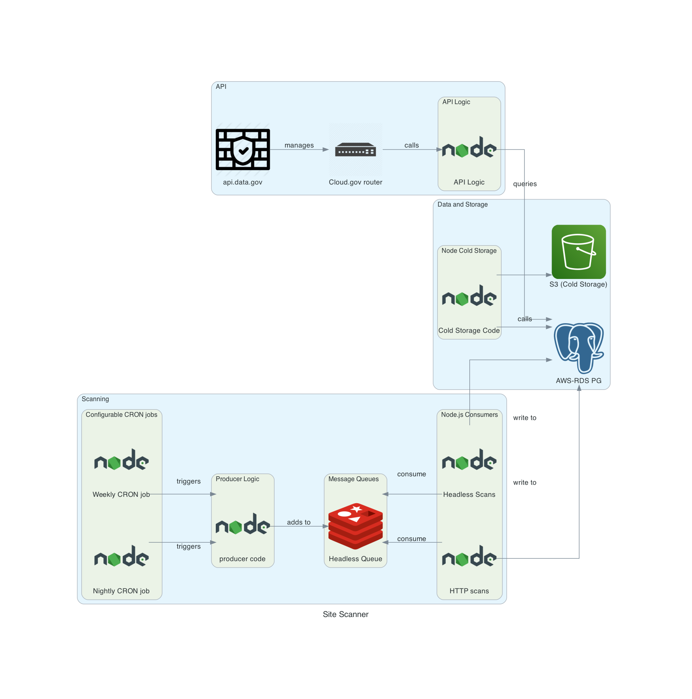

# Architecture Documentation

This directory has information about the architecture and infrastructure of the Scanner application.

## diagrams

The [diagrams](./diagrams) directory contains code that generates architecture diagrams. The diagram generator uses a Python library called "diagrams" which has a DSL for expressing architecture diagrams.

### Cloud.gov

